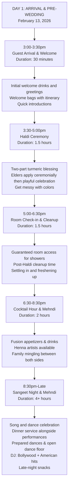
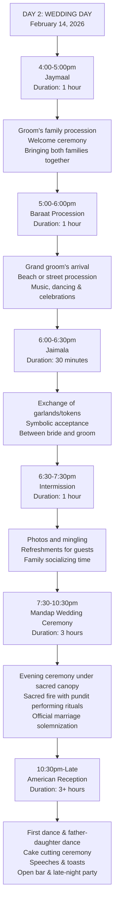

# Wedding Events Section Update Specification

## Overview
This document outlines the complete redesign of the Wedding Events section to replace the current simplified event listing with a comprehensive two-day timeline featuring 11 detailed events with cultural indicators, durations, and visual flow diagrams.

## Current State vs. Target State

### Current State
- Simple 4-event layout (Welcome Dinner, Haldi & Mehndi, Wedding Ceremony, Reception)
- Basic event cards with minimal information
- No cultural context or detailed timeline
- Generic date placeholders (June 2024 instead of February 2026)

### Target State
- Comprehensive 11-event timeline across two days
- Cultural indicators (Indian/American/Fusion)
- Detailed descriptions with durations
- Visual flow diagrams using Mermaid.js
- Responsive timeline layout
- Accurate February 2026 dates

## Event Schedule Data

### Day 1: Pre-Wedding Celebrations (February 13, 2026)

| Time | Event | Duration | Culture | Description |
|------|-------|----------|---------|-------------|
| 3:00-3:30pm | Guest Arrival & Welcome | 30 min | American | Initial welcome drinks and greetings, welcome bags with itinerary and local treats |
| 3:30-5:00pm | Haldi Ceremony | 1.5 hours | Indian | Two-part turmeric blessing: elders apply ceremonially (30 min), then playful free-for-all celebration with colors |
| 5:00-6:30pm | Room Check-in & Cleanup | 1.5 hours | American | Guaranteed room access for post-Haldi showers and freshening up, settling in time |
| 6:30-8:30pm | Cocktail Hour & Mehndi | 2 hours | Fusion | Fusion appetizers and drinks with Mehndi artists available for henna application, family mingling between both sides |
| 8:30pm-Late | Sangeet Night & Mehndi | 4+ hours | Indian | Song and dance celebration with ongoing Mehndi stations, dinner service with performances, prepared dances and open dance floor, DJ with Bollywood and American music, late-night snacks |

### Day 2: Wedding Day (February 14, 2026)

| Time | Event | Duration | Culture | Description |
|------|-------|----------|---------|-------------|
| 4:00-5:00pm | Jaymaal | 1 hour | Indian | Groom's family procession and welcome ceremony, bringing both villages/families together |
| 5:00-6:00pm | Baraat | 1 hour | Indian | Grand procession for groom's arrival, beach or street celebration with music and dancing |
| 6:00-6:30pm | Jaimala | 30 min | Indian | Exchange of garlands/tokens between bride and groom, symbolic acceptance |
| 6:30-7:30pm | Intermission | 1 hour | American | Photos, mingling, refreshments, family socializing before main ceremony |
| 7:30-10:30pm | Mandap Wedding Ceremony | 3 hours | Indian | Evening ceremony under sacred canopy with fire, pundit performing rituals, official marriage solemnization |
| 10:30pm-Late | American Reception | 3+ hours | American | First dance, father-daughter dance, cake cutting, speeches and toasts, open bar and late-night party |

## Visual Flow Diagrams

### Day 1 Flow (Mermaid)


### Day 2 Flow (Mermaid)


## Technical Implementation Requirements

### 1. Component Updates

#### Events.tsx Changes
- Replace current 4-event structure with 11-event timeline
- Implement day-based grouping (Day 1 & Day 2)
- Add cultural indicator components
- Integrate Mermaid.js for flow diagram rendering
- Update date references from June 2024 to February 2026
- Add duration displays for each event
- Implement expandable event details

#### Events.css Updates
- Create timeline-style layout instead of simple grid
- Add cultural indicator styling (color-coded badges)
- Implement responsive breakpoints for mobile/tablet/desktop
- Add animation transitions for interactive elements
- Style Mermaid diagram containers
- Create event card hover effects and interactions

### 2. Cultural Indicator System

#### Color Scheme
- **Indian**: Saffron/Orange (#FF6B35 or similar)
- **American**: Blue (#4A90E2 or similar) 
- **Fusion**: Purple/Gradient (#8B5CF6 or similar)

#### Badge Implementation
```tsx
interface CulturalBadgeProps {
  culture: 'Indian' | 'American' | 'Fusion';
}

const CulturalBadge: React.FC<CulturalBadgeProps> = ({ culture }) => {
  return (
    <span className={`cultural-badge cultural-badge--${culture.toLowerCase()}`}>
      {culture}
    </span>
  );
};
```

### 3. Responsive Design Requirements

#### Desktop (1024px+)
- Two-column layout with timeline on left, flow diagrams on right
- Full event cards with expanded descriptions
- Side-by-side day comparison

#### Tablet (768px-1023px)
- Single column with alternating event cards
- Collapsible flow diagrams
- Optimized spacing and typography

#### Mobile (320px-767px)
- Vertical timeline with compact event cards
- Expandable event details on tap
- Stacked flow diagrams with horizontal scroll

### 4. Mermaid.js Integration

#### Installation
```bash
npm install mermaid
npm install @types/mermaid --save-dev
```

#### Implementation
```tsx
import mermaid from 'mermaid';
import { useEffect, useRef } from 'react';

const FlowDiagram: React.FC<{ diagram: string; id: string }> = ({ diagram, id }) => {
  const diagramRef = useRef<HTMLDivElement>(null);

  useEffect(() => {
    mermaid.initialize({ startOnLoad: false });
    if (diagramRef.current) {
      mermaid.render(id, diagram).then((result) => {
        if (diagramRef.current) {
          diagramRef.current.innerHTML = result.svg;
        }
      });
    }
  }, [diagram, id]);

  return <div ref={diagramRef} className="mermaid-diagram" />;
};
```

### 5. Accessibility Requirements

- Proper heading hierarchy (h2 for day headers, h3 for event titles)
- ARIA labels for cultural indicators
- Keyboard navigation for interactive elements
- Screen reader compatible event descriptions
- High contrast ratios for all text and indicators
- Focus indicators for all interactive elements

### 6. Performance Optimization

- Lazy loading for Mermaid diagrams
- Optimized images for event icons
- Efficient CSS with minimal layout shift
- Progressive enhancement for JavaScript features
- Core Web Vitals optimization

## Testing Requirements

### 1. Playwright Browser Testing

#### Responsive Testing
- Test layout at 320px, 768px, 1024px, and 1440px breakpoints
- Verify event card stacking and alignment
- Test flow diagram rendering and responsiveness
- Validate cultural indicator visibility

#### Functionality Testing
- Test expandable event details
- Verify Mermaid diagram rendering
- Test smooth scrolling between sections
- Validate timeline navigation

#### Accessibility Testing
- Screen reader compatibility
- Keyboard navigation
- Color contrast validation
- Focus indicator testing

#### Cross-browser Testing
- Chrome, Firefox, Safari, Edge compatibility
- Mobile browser testing (iOS Safari, Chrome Mobile)
- Mermaid.js rendering consistency

### 2. Visual Regression Testing
- Before/after screenshots at all breakpoints
- Event card layout comparison
- Cultural indicator rendering
- Flow diagram display validation

## Implementation Timeline

### Phase 1: Data Structure & Basic Layout (2-3 hours)
1. Update Events.tsx with new event data structure
2. Implement basic timeline layout
3. Add cultural indicators
4. Update CSS for responsive design

### Phase 2: Mermaid Integration & Visual Enhancements (2-3 hours)
1. Install and configure Mermaid.js
2. Implement flow diagram components
3. Add interactive elements and animations
4. Fine-tune responsive behavior

### Phase 3: Testing & Optimization (1-2 hours)
1. Comprehensive Playwright testing
2. Performance optimization
3. Accessibility validation
4. Cross-browser compatibility testing

### Phase 4: Final Polish & Deployment (1 hour)
1. Visual refinements
2. Final testing validation
3. Code review and cleanup
4. Deployment preparation

## Success Criteria

### Functional Requirements
- ✅ All 11 events display with correct timing and descriptions
- ✅ Cultural indicators are clearly visible and color-coded
- ✅ Mermaid flow diagrams render properly on all devices
- ✅ Responsive layout works across all breakpoints
- ✅ Interactive elements function smoothly

### Performance Requirements
- ✅ Page load time remains under 3 seconds
- ✅ Core Web Vitals scores maintain or improve
- ✅ Mermaid diagrams load without blocking page render
- ✅ Smooth animations and transitions

### Accessibility Requirements
- ✅ WCAG 2.1 AA compliance maintained
- ✅ Screen reader compatibility verified
- ✅ Keyboard navigation fully functional
- ✅ Color contrast ratios meet standards

### User Experience Requirements
- ✅ Information hierarchy is clear and logical
- ✅ Event details are easy to scan and understand
- ✅ Visual flow diagrams enhance comprehension
- ✅ Mobile experience is optimized and touch-friendly

## Files to Modify

1. `frontend/src/components/Events.tsx` - Main component updates
2. `frontend/src/styles/Events.css` - Styling and responsive design
3. `frontend/package.json` - Add Mermaid.js dependency
4. `frontend/src/types/` - Add type definitions if needed

## Additional Notes

- Ensure all dates reference February 13-14, 2026 (not June 2024)
- Maintain consistency with existing wedding website theme
- Consider adding event location details if available
- Plan for potential future event updates or changes
- Document component props and interfaces thoroughly
